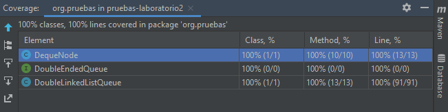
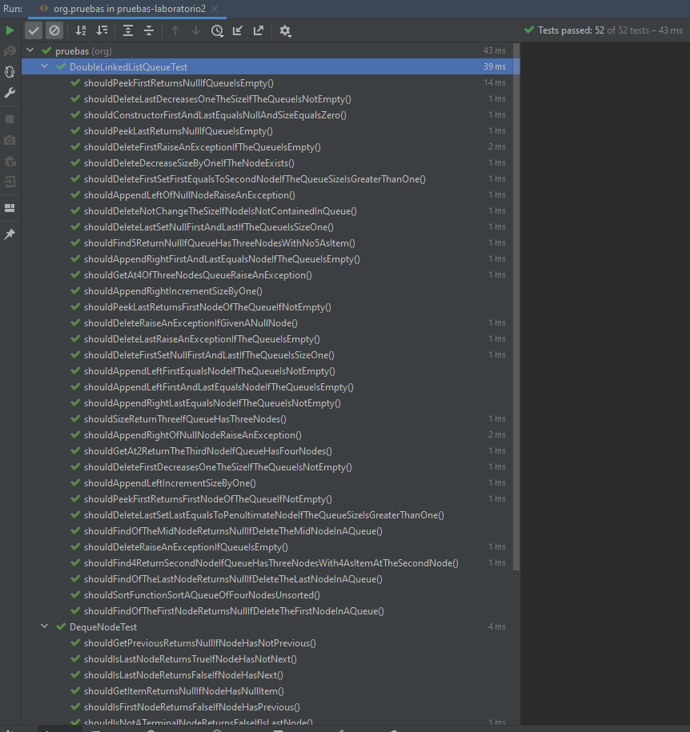
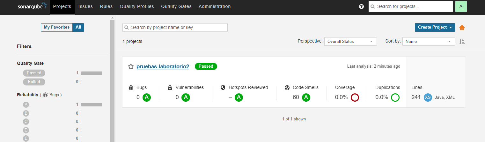
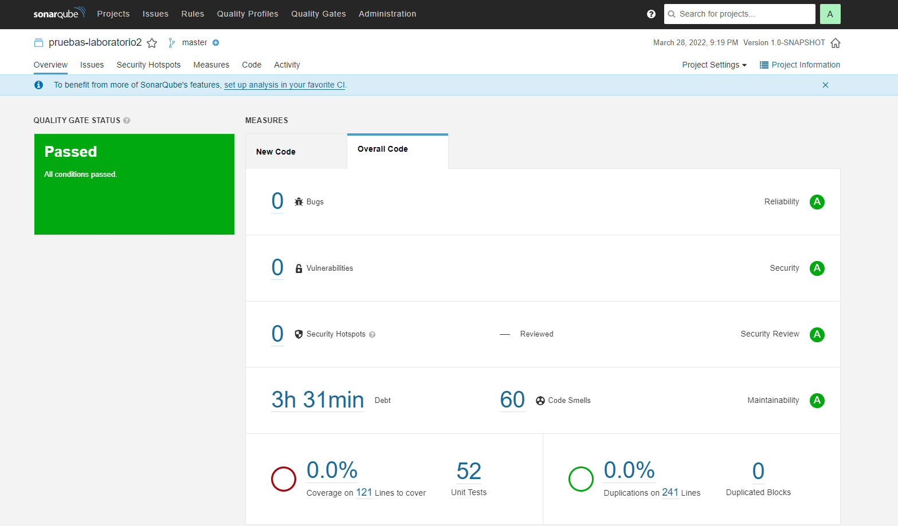

# pruebas-laboratorio2

This repository provides the implementation of a Double Linked List Queue, with the objective of testing it using jUnit 5, for the subject Mantenimiento y Pruebas del Software.

## Files

- *DequeNode.java* : this class represents the nodes that compose the Double Linked List Queue.
- *DoubleEndedQueue.java* : this interface defines the operations of the Double Linked List Queue.
- *DoubleLinkedListQueue.java* : class that contains the implementation of the Double Linked List Queue.  

- *DequeNodeTest.java* : class containing diferents tests for *DequeNode.java*, using jUnit 5.
- *DoubleLinkedListQueueTest.java* : class containing tests with jUnit 5, for testing the behavior of the Double Linked List Queue.
- *testCases.txt* : file where we can find all the test cases for the tests implemented in the two classes above.

## 100% coverage

With these tests, we can obtaing a 100% coverage.

## All tests passed

All the tests are executed successfully.

## Sonarqube

We used the tool Sonarqube (https://www.sonarqube.org) to analyze the quality of the implemented code. These were the results obtained:

The code passed all conditions, with 0 bugs, 0 vulnerabilies, 0 security hotspots and 0% duplications on 241 lines of code.

